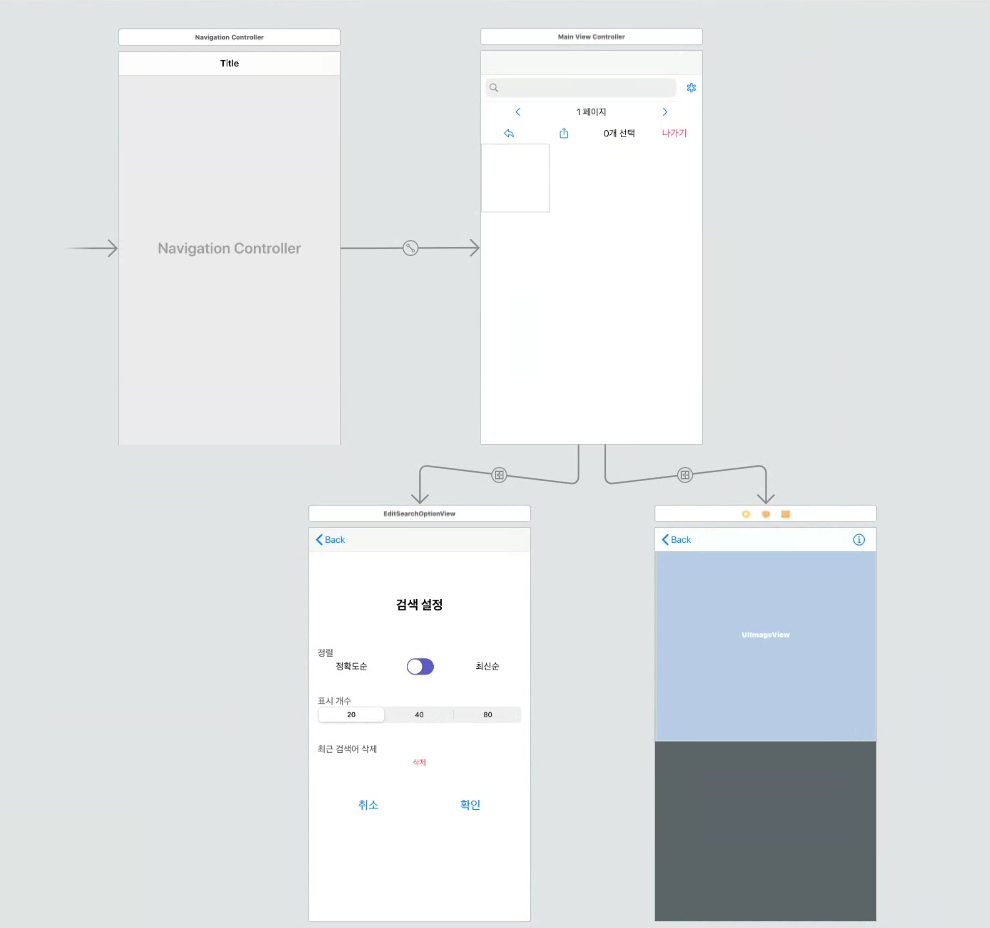
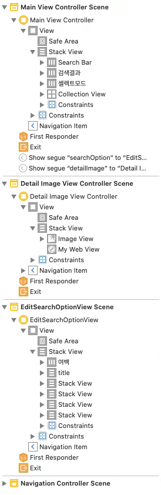

# ImageFinder

- 기존에 안드로이드로 만들어진 [ImageFinder](https://github.com/ApexCaptain/ImageFinder)프로젝트를 참고하여 ios 앱으로 만들어 보았습니다.
- 카카오 이미지 검색 api를 이용해서 만들었습니다.

## 기능 시연

### 이미지 검색 기능

   

### 페이지 변경 기능

- 버튼, 좌우 스와이프 제스처
     

### 검색옵션 변경 기능

- 정확도순/최신순
- 검색 개수

### 검색 기록 기능

   

- 기록
- 필터
- 검색 기록 삭제

### 새로고침 기능

   

### 이미지 상세보기 기능

- 원본이미지, 웹뷰
     

### 다중 이미지 선택 기능

- 공유
- 다운로드
     

### 동영상으로 보기

  

   

### 스토리보드

